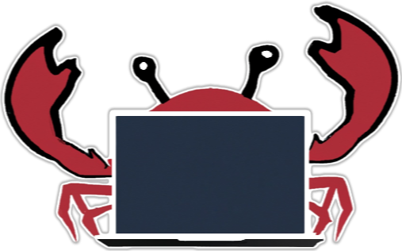

<p align="center">
  
</p>

# Crab
A tiny interpreted *crappy* toy language written in Rust.

## Iterative Fibonacci Algorithm

```
let n = 100;
if(n < 0){
    exit();
};

let a = 0;
let b = 1;

let loop_i = 0;
for(loop_i < n){
    let temp = a;
    let a = a + b;
    let b = temp;
    let loop_i = loop_i + 1;
    print(loop_i, ": ", a, "\n"); 
}
```
